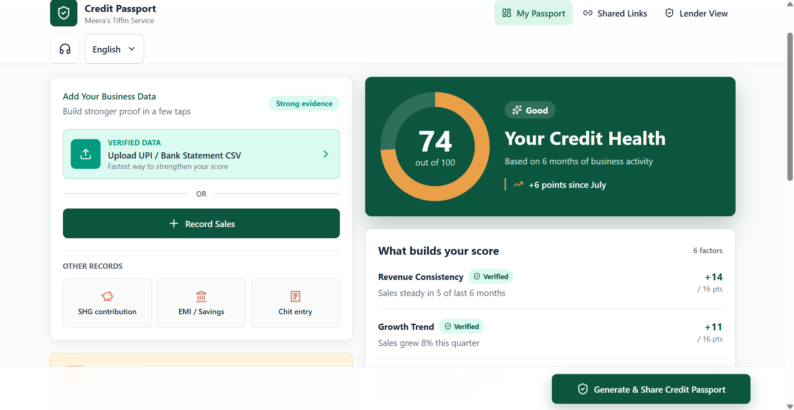
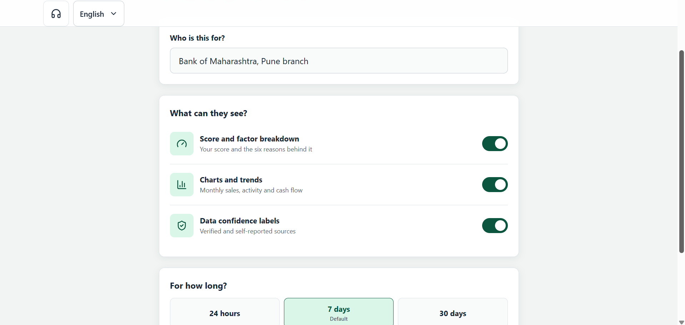
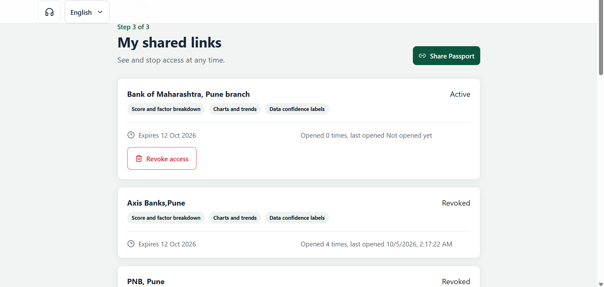
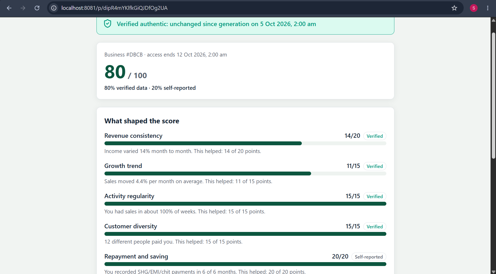

# CreditSakhi: Credit Passport for Women Micro-Entrepreneurs

> "She doesn't lack creditworthiness. She lacks proof. The Credit Passport turns her daily hustle into evidence a lender can trust, and into a plan she can act on."

Built for **She Solves 3.0** (Round 2: Prototype Development).

**Live frontend:** https://credit-passport-she.lovable.app
**Demo video:** https://drive.google.com/file/d/15ofT2RlB5vIeclhVVhZ9j9hl8IxhFCSE/view?usp=sharing

## Problem Statement
Millions of women in India run steady micro-businesses such as tiffin services, tailoring units and home bakeries. Their records live in notebooks, UPI transactions and memory. When they apply for a loan, lenders ask for ITRs, GST filings, audited statements and collateral. She has none of these, so she is rejected and is not told what to fix.

IFC research points to a large gap: it estimates that formal institutions meet only about 27% of the financing demand of women-owned MSMEs in India (IFC study, 2012). The gap is not creditworthiness. It is **evidence of creditworthiness in a form lenders trust**.

## Proposed Solution
She adds the data she already has. The system turns it into an explainable 0-100 score, a coaching plan, and a tamper-evident, shareable **Credit Passport**. She chooses who sees it and for how long, and can revoke access at any time.

## Features
**Borrower side**
- Add data by CSV upload (verified) or manual sales entry (self-reported); record SHG, EMI and chit entries.
- Score out of 100 with six factors: revenue consistency, growth trend, activity regularity, customer diversity, repayment and saving behaviour, cash-flow buffer.
- Plain-language note for each factor, and a verified / self-reported label on each.
- Coaching tips, and charts: monthly sales trend, activity view, inflow vs outflow.
- Consent form: who it is for, what they can see, and for how long (24 hours, 7 days, 30 days).
- Shared links list with status (active, expired, revoked), open count and instant revoke.
- English, Hindi and Marathi interface.

**Lender side (public link)**
- Authenticity check: "unchanged since generation".
- Score, factor breakdown, confidence split and monthly trend, limited to the sections the borrower allowed.
- No raw transactions or customer names are ever returned.
- Honest-limitations panel.

## Tech Stack
| Part | Technology |
|---|---|
| Frontend | React 19, TanStack Start / Router, Tailwind CSS, Recharts, Vite |
| Backend | Python, FastAPI, Uvicorn |
| Storage | SQLite |
| Integrity | SHA-256 hash of the frozen score snapshot |

## Installation & Setup
Requirements: Node.js, Python 3.10+.

```bash
git clone https://github.com/sunishaphadtare15/CreditSakhi.git
cd CreditSakhi
npm install
cd backend
pip install -r requirements.txt
```

## How to Run
Open two terminals.

**Terminal 1: backend** (from the `CreditSakhi` folder)
```bash
cd backend
# Set the frontend address used in share links (use the port Vite prints):
#   Windows PowerShell:  $env:PUBLIC_URL="http://localhost:8080"
#   macOS / Linux:       export PUBLIC_URL="http://localhost:8080"
python -m uvicorn main:app --reload --port 8000
```
API docs: http://localhost:8000/docs

**Terminal 2: frontend** (from the `CreditSakhi` folder)
```bash
npm run dev
```
Open the `Local:` address that Vite prints.

**Load the sample data (once):** open http://localhost:8000/docs, run `POST /api/demo/seed`, or run `Invoke-RestMethod -Method Post -Uri http://localhost:8000/api/demo/seed` in PowerShell.

**Try the full flow:** view the score, create a share link, open the link in a new tab (lender view), then revoke it and reload the link.

## API Overview
| Method | Path | Purpose |
|---|---|---|
| POST | /api/demo/seed | Load sample tiffin-business data |
| POST | /api/transactions/upload | CSV upload (date YYYY-MM-DD, description, amount, party) |
| POST | /api/transactions | Manual sale, or kind = shg / emi / chit |
| GET | /api/score | Score, six factors with tiers, tips, chart data |
| POST | /api/shares | Create a share link |
| GET | /api/shares | List shares with status and open count |
| POST | /api/shares/{id}/revoke | Revoke a link instantly |
| GET | /api/public/{token} | Lender view (404 unknown, 410 revoked or expired) |

## How Authenticity Works
Creating a share saves a frozen snapshot of the score and its SHA-256 hash. Only a hash of the link token is stored. The lender endpoint recomputes the snapshot hash, returns an `authentic` flag, and filters fields by the sections the borrower allowed.

## Project Structure
```
CreditSakhi/
  backend/            FastAPI app (main.py), requirements.txt, README
  src/
    routes/           pages, including the lender page p.$token.tsx
    lib/api.ts        calls to the backend
    components/       UI components (sharing flow, dashboard)
  public/
  package.json
```

## Screenshots
| Borrower dashboard | Share flow |
|---|---|
|  |  |

| Shared links | Lender view |
|---|---|
|  |  |

## Known Limitations
- The score is a supporting document, not a lending decision.
- Self-reported data can be manipulated, which is why every factor carries a verified / self-reported label.
- Scoring weights are uncalibrated and need testing against real repayment data in a pilot.
- Prototype scope: a single demo user (no login), SQLite file storage, no rate limiting.
- A shared link shows a frozen snapshot from the moment it was created; later changes do not appear on old links.

## Future Scope
- Real login and OTP, and borrower KYC.
- RBI Account Aggregator integration for consented bank data.
- WhatsApp delivery of the passport, and QR codes on a downloadable PDF.
- Lender API and a lender dashboard for browsing consented applicants.
- SHG and federation dashboards.
- Calibrating weights by sector and region with pilot repayment data.

